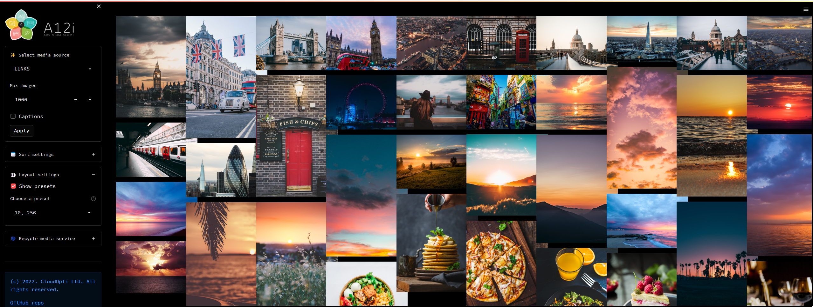

# Hybrid architecture media server, media service and Streamlit client app using FastAPI and Python

    date: "2022-07-10"
    author:
        name: "Arvindra Sehmi"
        url: "https://www.linkedin.com/in/asehmi/"
        mail: "vin [at] thesehmis.com"
        avatar: "https://twitter.com/asehmi/profile_image?size=original"
    related:
        https://github.com/asehmi/st-media-server is a similar FastAPI (client-server-only) version of this application
        https://github.com/asehmi/st-media-service is a similar pure Streamlit version of this application

## Overview

This Streamlit app renders an image grid and provides some controls to sort and layout the grid. Images can be served from a simple `FastAPI` media server or from an embedded media service object. If the media server is used, it can be started automatically from the Streamlit app on its own port and the same host (and process) as the Streamlit app, or it can be started standalone on a remote host machine.



### Try the demo app yourself

The embedded media service object confguration of this application can be seen running in the Streamlit Cloud at the link below:

[](https://asehmi-media-explorer-app-client-app-7vk2lf.streamlitapp.com/)

To run the `FastAPI` media server flavours of this application, clone the repo and run it locally with the appropriate configuration settings (see below). Launching FastAPI in Streamlit Cloud hasn't worked for me due to port binding issues, so instead use a hosting service that supports custom servers and ports, or build a Docker image. There are a few Streamlit Docker templates around if you search the Streamlit discussion forum.

The really cool thing about FastAPI is that it's easy to layer an API on a regular Python object. The object can also be used directly in a Python client application.

## Installation

```bash
$ cd st-media-explorer
$ pip install -r requirements.txt
```

If you wish to run or deploy the media server standalone:

```bash
$ cd st-media-explorer/media_server
$ pip install -r requirements.txt
```

## Usage

Run the included app to see how the Streamlit media explorer works:

```bash
$ streamlit run client_app.py
```

The demo client app is easily customised.

## Configuration

Media sources compatible with Streamlit's `st.image()` API are configured in `media_service.toml`. If this `toml` file isn't present the example `media_service.example.toml` is loaded instead. It should be obvious how to create your own service `toml` file. Note that two modes are supported, namely _local files_ (using the `media_folder` key) and _web links_ (using the `media_links` key). They are mutually exclusive and can't be intermixed.

You can configure grid layout options in `.streamlit/secrets.toml` (used by `client_app.py`). There are options for screen width and the number of columns displayed. This data is used to generate various layout presets which are selectable in the UI. Since my screen width is 2560 pixels wide, I have set the default screen width to this value. You're free to change the display options to match your device screen resolution. (Note, you may need to account for any screen scaling factor you may have active, e.g. a 3840 wide screen with 175% scaling is effectively 2190 wide.)

In addition to the above, this app allows you to choose from one of the following mutually exclusive modes of operation, which is configured in `.streamlit/secrets.toml`:

### _Remote Server_

- A standalone remote server should be started before (and independently of) the client app.
- This should be used for distributed client-server deployments.
- The server host, port, and http protocol must be set accordingly.

### _Embedded Server_

- A standalone local server will be started and run in its own thread from the client app.
- This should be used for localhost client-server deployments.
- The server host, port, and http protocol must be set accordingly.

### _Service Object_

- No server is involved and instead the client app will directly call a media service object interface.
- This should be used for simple local and Streamlit Cloud deployments.
- Server host, port, and http protocol are ignored.

### _Client-side configuration_

**.streamlit/secrets.toml**

```bash
# Choose one
# MODE = 'remote_server'
# MODE = 'embedded_server'
MODE = 'service_object'

# Assign the cloud host AFTER you know the deployment URL
# ( To deploy on Heroku you must configure a 'Procfile' and 'setup.sh',
#   and separate the frontend and backend deployments. Launching FastAPI in
#   Streamlit Cloud hasn't worked for me due to port binding issues. )

# HOST = '<user-repo-app-key>.herokuapp.com'
HOST = 'localhost'
PORT = 8888
HTTP_PROTOCOL = 'http' # 'https' if cloud host

# - layout presets are computed from these display options
# - computed preset format = Number of columns, Pixel width
# - the defaults indicate which layout to start with
[DISPLAY_OPTIONS]
screen_widths = [
    '2560', '2190', '1920', '1680', '1600', '1440', '1400',
    '1366', '1360', '1280', '1152', '1024', '800'
]
default_screen_width = '2560'
num_columns = [
    '1', '2', '3', '4', '5', '8',
    '10', '16', '20', '32', '40'
]
default_num_columns = '3'
```

### _Service configuration_

**media_service.toml**

```bash
# Singular values come above the key group values below to prevent them combining

MEDIA_TYPES = [
    'image/jpg',
    'image/jpeg',
    'image/png',
    'image/gif',
]

[MEDIA_SOURCES.'LOCAL 1']
media_folder = './images'
media_filter = 'unsplash'

[MEDIA_SOURCES.'LOCAL 2']
media_folder = './images'
media_filter = 'wallpaper'

[MEDIA_SOURCES.LINKS]
media_links = [
    'https://unsplash.com/photos/mOEqOtmuPG8/download?force=true&w=640',
    'https://unsplash.com/photos/g-krQzQo9mI/download?force=true&w=640',
    'https://unsplash.com/photos/Q6UehpkBSnQ/download?force=true&w=640',
    'https://unsplash.com/photos/iP8ElEhqHeY/download?force=true&w=640',
]
media_filter = 'unsplash'
```

### _Server-side configuration_

**media_server.toml**

```bash
# Assign the cloud host AFTER you know the deployment URL
# ( To deploy on Heroku you must configure a 'Procfile' and 'setup.sh',
#   and separate the frontend and backend deployments. Launching FastAPI in
#   Streamlit Cloud hasn't worked for me due to port binding issues. )

# HOST = '<user-repo-app-key>.herokuapp.com'
HOST = 'localhost'
PORT = 8888
```

If you update the media server `toml` whilst the client app is running, then restart/recycle the media server using the control provided in the client app.

---

If you enjoyed this app, please consider starring this repository.

Thanks!

Arvindra